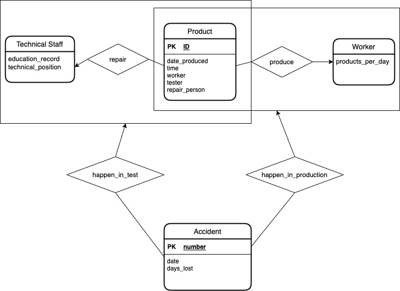
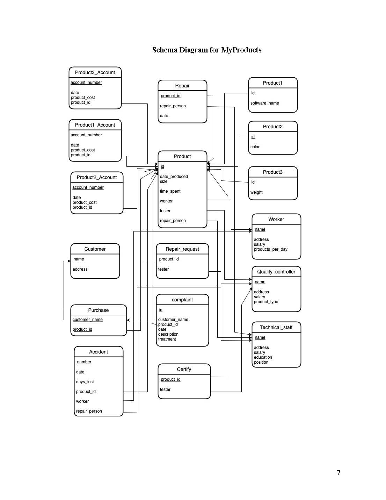

# MyProducts, Inc. Database System

**Date:** November 2022  
**Course:** CS/DSA 4513: Database Management  
**University:** University of Oklahoma (MS in Data Science and Analytics)

## Project Overview 
This project involves the end-to-end design and implementation of a relational database system for MyProducts, Inc., a manufacturing company. The system manages a complex ecosystem of three employee types (Technical Staff, Quality Controllers, and Workers), diverse product categories, customer complaints, and workplace accidents.

The primary objective was to move from a conceptual business description to a functional, cloud-hosted database solution using <b>Azure SQL Database</b>.

## Key Features & Business Logic 
The system implements several specific business constraints defined by the company's operational requirements: 
* <b>Specialized Workforce</b>: Different attributes are tracked for Technical Staff (education/degrees), Quality Controllers (product types checked), and Workers (daily production limits).
* <b>Product Lifecycle</b>: Each product tracks its production date, time spent, the worker who made it, the controller who tested it, and the staff who repaired it.
* <b>Conditional Repair Logic</b>: While most products can be repaired by any technical staff, Product1 requires a staff member with a graduate degree (MS or PhD) for repairs.
* <b>Accountability</b>: The database maintains unique accounts for each product category to track costs and manages a formal complaint system for defective products.

## Technical Tasks Performed 
The project was executed through seven distinct phases:

<b>1. Database Design & Modeling</b>
* <b>Conceptual Design</b>: Created a comprehensive ER Diagram to represent all entities and their relationships.

* <b>Logical Design</b>: Developed a relational schema and a Schema Diagram mapping all foreign key dependencies.

<b>2. Storage & Performance Optimization</b>
* <b>Storage Analysis</b>: Evaluated appropriate file organizations (e.g., B+ Trees, Hashing) by analyzing query frequencies, such as high-volume worker product retrievals (2,000/day).
* <b>Cloud Implementation</b>: Tailored storage structures specifically for the <b>Azure SQL Database</b> environment.

<b>3. Database Implementation</b>
* <b>SQL Development</b>: Wrote DDL statements to create tables with all necessary primary/foreign keys and constraints.
* <b>Complex Queries</b>: Implemented 15 specific business queries, including error tracking for quality controllers and average cost analysis.

<b>4. Application Development</b>
* <b>Java/JDBC Application</b>: Developed a console-based Java application to interface with the Azure SQL Database, featuring a menu for data entry, retrieval, and automated file import/export.
* <b>Web Interface</b>: Created a web application using JSP to handle employee entry and high-salary employee reporting.

## Tech Stack
* <b>Database</b>: Azure SQL Database.
* <b>Languages</b>: SQL (Transact-SQL), Java (JDBC), JSP, HTML.
* <b>Environment</b>: Distributed online environment
